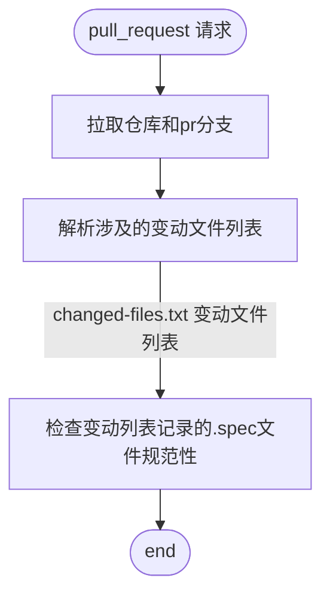

<!--
SPDX-FileCopyrightText: (C) 2025 Institute of Software, Chinese Academy of Sciences (ISCAS)
SPDX-FileContributor: lzyprime <2383518170@qq.com>

SPDX-License-Identifier: MulanPSL-2.0
-->

## 检查项

- 检查 spec 文件, Release 标签上需要有 `%autorelease`
- source 里像 url 的链接上面需要有 `#!RemoteAssert`

## 流程图

